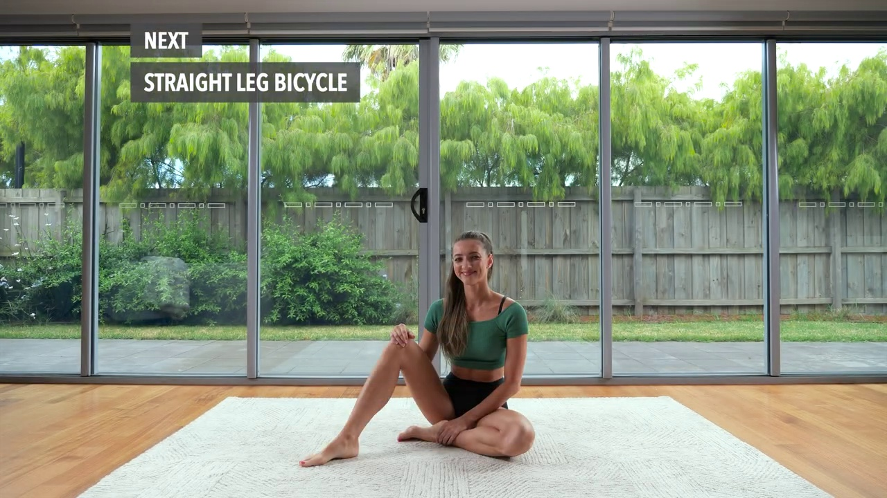

# video-segmentation-app
This tool can remove the background surrounding a person. This functionality can be utilized to develop an application or software that removes backgrounds.

## Overview

  
   

## Getting Started
### Data
* Download the example data from [google drive](https://drive.google.com/drive/folders/1G7XXEgMHpHnSkvFRVX5iJqN7sk3VjoM4?usp=sharing). I selected this data because there is a high contrast between the person and the background, and the model is working almost perfectly well.
* Put data into the `data` folder.

### Model
* Download the model from [google drive](https://drive.google.com/drive/folders/1B-1mUylAErxEESELRQYs-nFq6LNzGpKw?usp=sharing).
* Put video-seg.pt into the `model` folder.

### Run the Demo

    python run.py

## Fine tuning
To fine-tune the model, take an image, create a segmentation mask around it, and record the pixel coordinates of that mask in a txt file. The image and the txt file should have similar names. An example is provided in the training.

    from ultralytics import YOLO
    model = YOLO('./model/video-seg.pt')  # load a pretrained model
    model.train(data='./training/seg_person.yaml') # train the model

